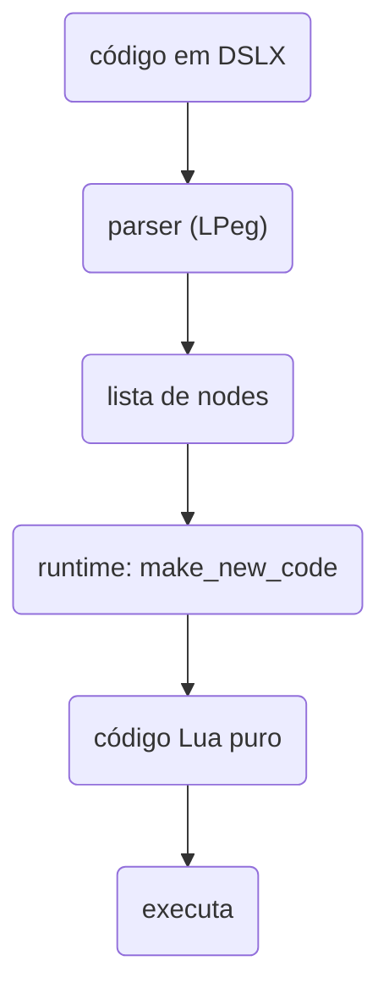

# DSLX - Davi System Lua-XML

<div style="display: flex; justify-content: center; justify-self: left;">
    
    <p>Um interpretador JSX-like para Lua.</p>
    <a href="https://luarocks.org/modules/pessoa736/daviluaxml">
        
    </a>
</div>

> [!WARNING]
> Projeto experimental. APIs podem mudar sem aviso.

## sumário

- [Sobre o que se trata o DSLX?](#sobre-o-que-se-trata-o-dslx)
- [Qual é o objetivo?](#qual-é-o-objetivo)
- [Status do projeto](#status-do-projeto)
- [Instalação](#instalação)
- [Como funciona?](#como-funciona)
  - [Sintaxe](#sintaxe)
  - [Importação dos .dslx através do require](#importação-dos-dslx-através-do-require)
- [API](#api)
- [O que DSLX não é](#o-que-dslx-não-é)
- [Porque surgiu](#porque-surgiu)
- [Licença](#licença)
- [Como posso contribuir](#como-posso-contribuir)
- [Créditos e referências](#créditos-e-referências)
  - [Contribuintes](#contribuintes)
- [Ferramentas de IA utilizados](#ferramentas-de-ia-utilizados)

## sobre o que se trata o DSLX?

DSLX (ou Davi System: Lua XML) é um módulo que fornece ao Lua a capacidade de interpretar arquivos .dslx no qual permite ler código Lua e transformar o XML em Lua puro num mesmo arquivo e depois executa, parecido com o JSX.

A partir da versão 2.0 o módulo foi renomeado para `dslx` e reescrito sobre [LPeg](http://www.inf.puc-rio.br/~roberto/lpeg/): o parser transforma o código em uma lista de nodes e o runtime gera (e executa) código Lua puro a partir deles.



## qual é o objetivo?

Fazer uma linguagem JSX-like para Lua, com a melhor eficiência, performance, dentro do que for possível, focando em Lua puro.

## status do projeto

O projeto está em estado experimental, mesmo com uma base da estrutura bem sólida, muitas APIs e muitos conceitos podem mudar a qualquer momento. E bugs são esperados.

## instalação

```bash
luarocks install daviluaxml
```

Requisitos: Lua 5.5 e [LPeg](http://www.inf.puc-rio.br/~roberto/lpeg/) (instalado automaticamente como dependência).

## como funciona?

No .dslx qualquer função definida no ambiente do Lua pode ser chamada no formato do XML. A tag vira uma chamada de função que recebe uma única tabela com o nome da tag, as props e os childrens:

```lua
soma({ name = "soma", props = { t = 9 }, childrens = { 1, 2, 3 } })
```

Um exemplo completo, direto no Lua:

```lua
local dslx = require("dslx")
local parser, runtime = dslx.parser, dslx.runtime

local code = [[
local function soma(el)
    local total = el.props.t
    for _, v in ipairs(el.childrens) do total = total + v end
    return total
end

print(<soma t={9}>{1}{2}{3}</soma>)
]]

local nodes = parser(code)
print(runtime:make_new_code(nodes)) -- código Lua gerado
runtime:runtime(nodes)             -- executa: 15
```

O `parser` devolve a lista de nodes do código, `runtime:make_new_code` gera o código Lua equivalente e `runtime:runtime` compila e executa. O `print(<soma t={9}>{1}{2}{3}</soma>)` vira:

```lua
print(soma({name = "soma", props = {["t"] = ((function() return 9 end)()), ["node_type"] = "element_prop"}, childrens = {((function() return 1 end)()), ((function() return 2 end)()), ((function() return 3 end)())}}))
```

Cada expressão `{...}` vira uma IIFE `((function() return ... end)())`, avaliada na hora da execução. Note que a função `soma` está dentro da string `code`: ela vira parte do código Lua gerado, então locais do script externo não são visíveis pra ela.

### sintaxe

Props e childrens podem ser strings, expressões Lua, booleans ou elementos aninhados (conteúdo de um arquivo `.dslx`):

```dslx
local function card(el)
    -- props
    el.props.titulo   -- "olá"    (string)
    el.props.largura  -- 10       (expressão Lua)
    el.props.destaque -- true     (boolean, só o nome da prop)

    -- childrens
    el.childrens[1]    -- "texto " (texto literal)
    el.childrens[2]    -- 42       (expressão Lua)
    el.childrens[3]    -- tabela   (elemento aninhado)
end

-- tag completa
local c1 = <card titulo="olá" largura={10} destaque>texto {40 + 2} <card/></card>

-- tag self-close
local c2 = <card titulo="tchau"/>
```

Um elemento aninhado vira uma chamada ao componente dentro da tabela de childrens: o valor retornado por ele é o que aparece em `el.childrens`. Se o componente retornar `nil`, o children simplesmente não existe. E como em Lua os valores são avaliados antes do constructor da tabela, o elemento aninhado roda antes do pai.

### importação dos .dslx através do require

Quando seu projeto importa o módulo do DSLX ele carrega o loader do DSLX, sobrepondo o require no ambiente no qual foi importado, permitindo importar o .dslx da mesma forma do .lua:

```lua
package.path = package.path .. ";./dslx/test/dslx/?.dslx"
local dslx = require("dslx") -- instala o searcher automaticamente
local ok = require("1")     -- carrega e executa 1.dslx
print("import ok:", ok)     -- true
```

## API

### parser

```lua
local nodes = parser(code)
```

Transforma o código em uma lista de nodes. Cada node tem um `node_type`: `lua`, `script`, `string`, `children`, `props`, `element`, `full_element`, `element_self_close` ou `element_prop`. Em falha, devolve uma tabela vazia.

### runtime

- `runtime:addHandler(name, func)` — registra um handler customizado por `node_type` (`name` pode ser uma string ou uma tabela de nomes)
- `runtime:expr(node, handlers)` — devolve o código Lua de um node
- `runtime:make_new_code(nodes, handlers)` — devolve o código Lua completo
- `runtime:runtime(nodes, handlers)` — compila e executa o código

### compile

```lua
compile({
    input = "arquivo.dslx",       -- arquivo .dslx de entrada (ou código, com asfile = false)
    asfile = true,                -- lê input como arquivo
    tofile = true,                -- escreve a saída em arquivo (false: devolve o código)
    run = false,                  -- executa o resultado
    output_name = nil,            -- nome do arquivo de saída (default: nome do input)
    output_ext = ".lua",          -- extensão da saída
    output_dir = ".",            -- diretório da saída
    relative_actual_file = false, -- resolve caminhos relativos ao arquivo que chamou
})
```

Com `tofile = false` e `run = false` o `compile` devolve o código gerado; com `run = true` executa o resultado.

### import

- `import.install()` / `import.uninstall()` — adiciona/remove o searcher de .dslx do `require()`
- `import.loadfile(filename, opts)` — carrega um .dslx direto
- `import.reload(name)` — recarrega um módulo já importado
- `import.clear()` — limpa os módulos .dslx carregados e o cache
- `import.path` — o `package.path` usado pelo searcher
- `import.use_cache` — cache de compilação (default: true)

## o que DSLX não é

- **não é html**, html é uma linguagem web para criação de páginas, o DSLX é um Lua+XML. e XML é uma linguagem de estruturação rígida para sistemas.

- **não é um substituto do Lua**, o DSLX é para funcionar em conjunto ao Lua

## porque surgiu?

eu estava afim de desenvolver ferramentas Lua separadas para criar uma framework web na mesma pegada do next.js e react. para isso pensei primeiro em criar um JSX-like so que Lua. comecei pincelando a ideia manualmente e depois fui pedindo ajuda ao copilot.
caso queira da uma olhada como ta o processo de criação da framework: [Pudimweb](https://github.com/pessoa736/PudimWeb)

## licença

Esse módulo é MIT. Sinta-se livre para brincar e fazer o que quiser a sua fork desse projeto, mantendo os créditos :)

## Como posso contribuir

Qualquer um pode contribuir com o projeto. Ao encontrar qualquer problema/bug ou se tiver alguma ideia de implementação, pode abrir uma issue para relatar o problema ou fazer um fork com sua implementação.

## Créditos e referências

Criado e mantido por [Davi Passos](https://github.com/pessoa736).

versão em inglês [joão victor](https://github.com/JvR-348)

Inspirado em [JSX](https://facebook.github.io/jsx/) pela [Meta](https://facebook).

## contribuintes

- [Davi Passos](https://github.com/pessoa736)

## ferramentas de IA utilizados

- chatgpt (5, 5.1 e 5.1-codex)
- claude 4.5 (opus e sonnet)
- gemini 3.0 pro
